# Architecture

## Who
Engineers, maintainers, and technical reviewers who need to reason about pipeline behavior and change impact.

## What
The canonical 11-stage turn pipeline (`observe.turn` → `answer.commit`) is the governing runtime contract for TestBot.
This document defines the required stage ordering, stage-level invariants, memory/provenance structures, and answer guardrails that all implementations must preserve.

## When
Use this document when proposing pipeline changes, reviewing design tradeoffs, or debugging behavior that spans multiple stages.

## Where
Applies to the runtime flow implemented in `src/testbot/` and the behavior contract captured by `features/` scenarios.

## Why
These design decisions prioritize deterministic memory-grounded answers with explicit citation/fallback guardrails over broader but less reliable conversational behavior.

## Mission
TestBot awareness is produced from both conversational memory and source ingestion from external systems.

### How Mission is operationalized

Policy-facing, testable product principles that operationalize Mission claims are defined in [docs/directives/product-principles.md](directives/product-principles.md).
- **Source ingestion** continuously normalizes external evidence into retrievable records alongside conversation memory.
- **Provenance** is required on knowing-mode answers so users can see what memory and source evidence informed the response.
- **Trust tier** metadata is preserved for ingested sources so policy and retrieval can apply explicit trust boundaries.
- **Deterministic fallback** ensures the assistant degrades safely (including uncertainty responses) when evidence is weak or unavailable.

### Continuity commitments
- **`answer.commit` must persist cross-turn control state**: each completed turn writes confirmed user facts, remaining obligations, pending repair state, and answer provenance into committed next-turn state.
- **`commit_receipt` continuity evidence is normative for context/retrieval**: continuity anchors consumed by context resolution and evidence retrieval must come from committed receipts so behavior is reproducible and inspectable.
- **Persistence exists to preserve user agency across turns**: explicit continuity state lets users amend facts, satisfy obligations, and complete repair flows without losing conversational control.

For deterministic reject diagnostics and machine-readable fallback reasons, see [docs/reject-taxonomy.md](reject-taxonomy.md).

Terminology note: use canonical pipeline identifiers as normative names and pair them with standard AI wording when needed per [docs/terminology.md](terminology.md).

Program linkage: [`ISSUE-0013-canonical-turn-pipeline-primary-bug-elimination-program.md`](issues/ISSUE-0013-canonical-turn-pipeline-primary-bug-elimination-program.md) is the project's **primary bug-elimination program** in the current state; contributors should triage canonical pipeline defects and follow-on work against ISSUE-0013 first, with ISSUE-0012 treated as linked delivery planning context in [`ISSUE-0012-canonical-turn-pipeline-delivery-plan.md`](issues/ISSUE-0012-canonical-turn-pipeline-delivery-plan.md).

## Legacy v0 compatibility note (historical)

Earlier revisions described a simplified 6-stage flow (`observe → intent → encode → retrieve → rerank → answer`). Treat that model as historical shorthand only; runtime design and acceptance criteria are governed by the canonical 11-stage pipeline in [docs/architecture/canonical-turn-pipeline.md](architecture/canonical-turn-pipeline.md).

## Pipeline overview

TestBot follows a canonical state-first loop for every turn:

```mermaid
flowchart LR
    observe[observe.turn] --> encode[encode.candidates]
    encode --> stabilize[stabilize.pre_route]
    stabilize --> context[context.resolve]
    context --> intent[intent.resolve]
    intent --> retrieve[retrieve.evidence]
    retrieve --> decide[policy.decide]
    decide --> assemble[answer.assemble]
    assemble --> validate[answer.validate]
    validate --> render[answer.render]
    render --> commit[answer.commit]
```



1. **`observe.turn`**
   - Capture raw utterance, timing, channel, and prior turn context without interpretation loss.
2. **`encode.candidates`**
   - Generate multiplicity-preserving candidate encodings (speech-act/fact/repair/query candidates).
3. **`stabilize.pre_route`**
   - Persist stable pre-routing artifacts (utterance card + fact/dialogue candidates with provenance).
4. **`context.resolve`**
   - Enrich state with pending repair, obligations, prior-offer anchors, and focus references.
5. **`intent.resolve`**
   - Resolve intent from enriched state rather than raw text projection.
6. **`retrieve.evidence`**
   - Retrieve evidence coherent with resolved intent and stabilized turn state.
7. **`policy.decide`**
   - Select semantic response class (`answer_from_memory`, clarification, repair continuation, etc.).
8. **`answer.assemble`**
   - Assemble answer candidate content bound to explicit evidence/provenance.
9. **`answer.validate`**
   - Validate grounding, citation/provenance contract, and decision-answer alignment.
10. **`answer.render`**
    - Render user-visible response without changing semantic class.
11. **`answer.commit`**
    - Commit assistant memory/provenance plus updated repair and obligation state for the next turn.

## Canonical per-turn state

The canonical unit of reasoning/review is a typed `PipelineState` object (`src/testbot/pipeline_state.py`).
Each runtime stage receives a `PipelineState` and returns an updated `PipelineState` with normalized fields:

- `user_input`
- `rewritten_query`
- `retrieval_candidates`
- `reranked_hits`
- `confidence_decision`
- `draft_answer`
- `final_answer`
- `claims`
- `provenance_types` (`MEMORY`, `CHAT_HISTORY`, `SYSTEM_STATE`, `GENERAL_KNOWLEDGE`, `INFERENCE`, `UNKNOWN`)
- `used_memory_refs`
- `used_source_evidence_refs`
- `source_evidence_attribution`
- `basis_statement`
- `invariant_decisions`

Design rule: turn-level runtime logging must serialize this same structure (JSONL snapshots), so runtime evidence and in-memory reasoning artifacts stay structurally identical.

## Memory cards

Memory is represented as text cards with stable field labels.

### Utterance memory card

```text
type: user_utterance | assistant_utterance
ts: <UTC ISO8601>
speaker: user | assistant
channel: satellite
doc_id: <stable identifier>
text: <utterance>
```

### Reflection memory card

```text
type: reflection
ts: <UTC ISO8601>
about: <speaker>
source_doc_id: <linked utterance doc_id>
doc_id: <stable identifier>
reflection:
claims: [...]
commitments: [...]
preferences: [...]
uncertainties: [...]
followups: [...]
confidence: 0.0..1.0
```

Design rule: reflection cards are hypotheses and must stay linked to source utterances.

Promotion-policy note: reflection promotion consumes a structured payload with `claims`, `uncertainties`, and `confidence`. Claims are normalized into typed records (`text`, `category`, `reliability`, `source`) before evaluation so promotion routing is based on normalized claim metadata rather than brittle phrase matching.

## Rerank overview

Time-aware reranking biases retrieval toward memories near an inferred target time.

- Parse temporal phrases (for example: `2 hours ago`, `last week`, `from now`).
- Compute `target_time` from utterance + current `now`.
- Set uncertainty `σ` as a fraction of distance between `target_time` and `now`.
- Apply Gaussian weight so near-time cards are boosted and distant cards are suppressed.

This rerank pass is combined with semantic retrieval scores to improve temporal relevance.

## Rerank objective (versioned config)

Configured objective artifact: `config/rerank_objective.json` with explicit `objective_name` + `objective_version`.

Formula:

```text
final_score = semantic_score * type_prior * (base_temporal_blend + gaussian_temporal_blend * temporal_gaussian_weight)
```

Default parameters (v1):

| Parameter | Default | Rationale |
| --- | --- | --- |
| `base_temporal_blend` | `0.25` | Preserves baseline semantic influence even when temporal evidence is weak/noisy. |
| `gaussian_temporal_blend` | `0.75` | Gives temporal alignment dominant but bounded influence when timestamp proximity is strong. |
| `reflection_type_prior` | `0.7` | Slightly down-weights reflection cards versus direct utterance/memory cards to reduce speculative wins. |
| `default_type_prior` | `1.0` | Keeps non-reflection card types unpenalized by default. |

Each candidate exposes `objective`, `objective_version`, `semantic_score`, `temporal_gaussian_weight`, `temporal_blend`, `type_prior`, and `final_score` in session logs for ranking audits.

Confidence policy thresholds (`top_final_score_min`, margin, ambiguity override) are loaded from the same artifact so objective scoring and fallback policy stay in sync.

### Rerank calibration workflow

1. **Dataset slice**
   - Use `eval/cases.jsonl` memory-lookup examples plus an explicit ambiguity slice (near-tie candidates) and stale-memory slice (high similarity but distant timestamps).
2. **Optimization target**
   - Maximize `hit_at_k` (k=4) while minimizing `dont_know_from_memory_decisions`, evaluated by `scripts/eval_recall.py`.
   - Keep deterministic ordering and ambiguity behavior unchanged (tie-break invariants remain hard constraints).
3. **Procedure**
   - Copy `config/rerank_objective.json` and bump `objective_version` for each candidate.
   - Run baseline and candidate objective comparisons with `scripts/eval_recall.py --objective-config ... --compare-objective-config ...`.
   - Inspect per-case objective attribution deltas before promoting a candidate objective.
4. **Acceptance criteria**
   - Candidate objective improves or maintains `hit_at_k` with no regression >0.02 absolute.
   - Candidate objective does not increase ambiguous unresolved top ties on the ambiguity slice.
   - Candidate objective does not increase IDK decisions by more than 1 case on the canonical fixture set.

## Answer contract

- Responses with factual claims must include memory citation fields `doc_id` and `ts`.
- Every non-trivial final answer (not deny/fallback/clarify) must emit provenance metadata in pipeline state and logs:
  - `claims` is a non-empty list of extracted claim strings.
  - `provenance_types` is a non-empty subset of the canonical enum values (`MEMORY`, `CHAT_HISTORY`, `SYSTEM_STATE`, `GENERAL_KNOWLEDGE`, `INFERENCE`, `UNKNOWN`).
  - `used_memory_refs` lists concrete memory references used to ground the answer (for example `<doc_id>@<ts>`).
  - `basis_statement` briefly explains what evidence classes the answer relied on.
- Packed-history outputs (`open_questions`, `constraints`, `topic_entity_hints`) are heuristic context artifacts (for prompting and transparency), not hard evidence. They should be labeled as advisory and must never be the sole provenance for a knowing-mode non-trivial answer.
- If memory context is weak or citation rules are violated, output must be exactly:
  - `I don't know from memory.`

## Architecture acceptance criteria

| Criterion | Current status | Last verified | Verification command | Evidence artifact |
| --- | --- | --- | --- | --- |
| Canonical stage ordering (`observe.turn`→`answer.commit`) remains intact with no stage elision. | pass | 2026-03-06 | `python scripts/all_green_gate.py --json-output artifacts/all-green-gate-summary.json` | `artifacts/all-green-gate-summary.json` |
| Reflection cards always include `source_doc_id` linkage. | partial | 2026-03-06 | `python -m behave` | `docs/qa/feature-status-report.md` |
| Time-aware rerank is applied when target time can be inferred. | pass | 2026-03-06 | `python -m pytest tests/test_eval_runtime_parity.py` | `docs/qa/feature-status-report.md` |
| Citation contract is enforced before final output is returned. | pass | 2026-03-06 | `python -m behave` | `docs/qa/feature-status-report.md` |
| Non-trivial answers always include provenance metadata with allowed enum values. | pending | 2026-03-06 | `python -m pytest -m "not live_smoke"` | `artifacts/feature-status-summary.json` |

Maintenance note: Refresh `Current status`, `Last verified`, and evidence links whenever runtime behavior (`src/testbot/`) or directive/invariant policy files (`docs/directives/`, `docs/invariants.md`, `docs/invariants/`) change.


## Source acquisition lifecycle and trust boundaries

Source acquisition is handled by a connector protocol and ingestion orchestrator in `src/testbot/source_connectors.py` and `src/testbot/source_ingest.py`.

Lifecycle:

1. **Fetch**
   - A connector fetches raw source items using a connector cursor/watermark (`fetch`).
2. **Normalize**
   - Each source item is normalized into a canonical document (`normalize`).
3. **Canonicalize for storage**
   - Ingestion creates two document forms:
     - source-memory document (`record_kind: source_memory`)
     - source-evidence document (`record_kind: source_evidence`, `type: source_evidence`)
4. **Store provenance metadata**
   - Every stored source artifact carries: `source_type`, `source_uri`, `retrieved_at`, `trust_tier`.
   - Source document ID resolution precedence is deterministic and idempotent: explicit `Document.id`, then metadata `doc_id`, then a derived fallback from stable identity material (`source_type`, `source_uri`, and normalized content hash). The fallback intentionally excludes `retrieved_at` so unchanged source content keeps the same ID across repeated ingests.
5. **Advance cursor**
   - Connector updates its cursor/watermark after successful fetch+normalize (`update_cursor`).

Trust boundaries:

- **Tiered trust is explicit metadata**, not an implicit score; downstream stages can reason about `trust_tier` directly.
- **Source evidence is attributable** through `used_source_evidence_refs` and `source_evidence_attribution`, separate from chat-memory refs.
- **Deterministic fallback remains preserved**: if source evidence is unavailable, retrieval behavior degrades to memory-card-only ranking without non-deterministic branching.
