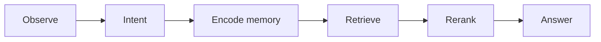

# Architecture

## Who
Engineers, maintainers, and technical reviewers who need to reason about pipeline behavior and change impact.

## What
The v0 memory-grounded pipeline (observe → intent → encode → retrieve → rerank → answer), memory-card structures, and answer guardrails.

## When
Use this document when proposing pipeline changes, reviewing design tradeoffs, or debugging behavior that spans multiple stages.

## Where
Applies to the runtime flow implemented in `src/testbot/` and the behavior contract captured by `features/` scenarios.

## Why
These design decisions prioritize deterministic memory-grounded answers with explicit citation/fallback guardrails over broader but less reliable conversational behavior.

## Pipeline overview

TestBot follows a single loop designed for memory-grounded answers:



1. **Observe**
   - Receive user utterance from Home Assistant satellite.
   - Capture assistant response for history.
2. **Intent**
   - Classify utterance into `IntentType` using deterministic rules.
   - Route memory-recall, meta-conversation, control, and knowledge requests predictably.
3. **Encode memory**
   - Persist user/assistant utterances as structured cards.
   - Generate and store reflection cards linked to source utterances.
4. **Retrieve**
   - Rewrite user input into a retrieval-oriented query.
   - Fetch memory cards and source-evidence candidates from vector search.
   - Deterministically mix source evidence with memory cards before rerank.
5. **Rerank**
   - Infer target time from natural language cues.
   - Apply Gaussian time weighting centered on inferred target time across mixed candidates.
6. **Answer**
   - Provide recent chat window + memory context to the answer stage.
   - Enforce memory-only answering and citation contract.

## Canonical per-turn state

The canonical unit of reasoning/review is a typed `PipelineState` object (`src/testbot/pipeline_state.py`).
Each runtime stage receives a `PipelineState` and returns an updated `PipelineState` with normalized fields:

- `user_input`
- `rewritten_query`
- `retrieval_candidates`
- `reranked_hits`
- `confidence_decision`
- `draft_answer`
- `final_answer`
- `claims`
- `provenance_types` (`MEMORY`, `CHAT_HISTORY`, `SYSTEM_STATE`, `GENERAL_KNOWLEDGE`, `INFERENCE`, `UNKNOWN`)
- `used_memory_refs`
- `used_source_evidence_refs`
- `source_evidence_attribution`
- `basis_statement`
- `invariant_decisions`

Design rule: turn-level runtime logging must serialize this same structure (JSONL snapshots), so runtime evidence and in-memory reasoning artifacts stay structurally identical.

## Memory cards

Memory is represented as text cards with stable field labels.

### Utterance memory card

```text
type: user_utterance | assistant_utterance
ts: <UTC ISO8601>
speaker: user | assistant
channel: satellite
doc_id: <stable identifier>
text: <utterance>
```

### Reflection memory card

```text
type: reflection
ts: <UTC ISO8601>
about: <speaker>
source_doc_id: <linked utterance doc_id>
doc_id: <stable identifier>
reflection:
claims: [...]
commitments: [...]
preferences: [...]
uncertainties: [...]
followups: [...]
confidence: 0.0..1.0
```

Design rule: reflection cards are hypotheses and must stay linked to source utterances.

## Rerank overview

Time-aware reranking biases retrieval toward memories near an inferred target time.

- Parse temporal phrases (for example: `2 hours ago`, `last week`, `from now`).
- Compute `target_time` from utterance + current `now`.
- Set uncertainty `σ` as a fraction of distance between `target_time` and `now`.
- Apply Gaussian weight so near-time cards are boosted and distant cards are suppressed.

This rerank pass is combined with semantic retrieval scores to improve temporal relevance.

## Rerank objective (canonical)

Named objective: `semantic_temporal_type_v1`.

Formula:

```text
final_score = semantic_score * type_prior * (base_temporal_blend + gaussian_temporal_blend * temporal_gaussian_weight)
```

Canonical parameters:

| Parameter | Default | Rationale |
| --- | --- | --- |
| `base_temporal_blend` | `0.25` | Preserves baseline semantic influence even when temporal evidence is weak/noisy. |
| `gaussian_temporal_blend` | `0.75` | Gives temporal alignment dominant but bounded influence when timestamp proximity is strong. |
| `reflection_type_prior` | `0.7` | Slightly down-weights reflection cards versus direct utterance/memory cards to reduce speculative wins. |
| `default_type_prior` | `1.0` | Keeps non-reflection card types unpenalized by default. |

Each candidate exposes `semantic_score`, `temporal_gaussian_weight`, `temporal_blend`, `type_prior`, and `final_score` in session logs for ranking audits.

## Answer contract

- Responses with factual claims must include memory citation fields `doc_id` and `ts`.
- Every non-trivial final answer (not deny/fallback/clarify) must emit provenance metadata in pipeline state and logs:
  - `claims` is a non-empty list of extracted claim strings.
  - `provenance_types` is a non-empty subset of the canonical enum values (`MEMORY`, `CHAT_HISTORY`, `SYSTEM_STATE`, `GENERAL_KNOWLEDGE`, `INFERENCE`, `UNKNOWN`).
  - `used_memory_refs` lists concrete memory references used to ground the answer (for example `<doc_id>@<ts>`).
  - `basis_statement` briefly explains what evidence classes the answer relied on.
- If memory context is weak or citation rules are violated, output must be exactly:
  - `I don't know from memory.`

## Architecture acceptance criteria

- [ ] Observe→intent→encode→retrieve→rerank→answer flow remains intact.
- [ ] Reflection cards always include `source_doc_id` linkage.
- [ ] Time-aware rerank is applied when target time can be inferred.
- [ ] Citation contract is enforced before final output is returned.
- [ ] Non-trivial answers always include provenance metadata with allowed enum values.


## Source acquisition lifecycle and trust boundaries

Source acquisition is handled by a connector protocol and ingestion orchestrator in `src/testbot/source_connectors.py` and `src/testbot/source_ingest.py`.

Lifecycle:

1. **Fetch**
   - A connector fetches raw source items using a connector cursor/watermark (`fetch`).
2. **Normalize**
   - Each source item is normalized into a canonical document (`normalize`).
3. **Canonicalize for storage**
   - Ingestion creates two document forms:
     - source-memory document (`record_kind: source_memory`)
     - source-evidence document (`record_kind: source_evidence`, `type: source_evidence`)
4. **Store provenance metadata**
   - Every stored source artifact carries: `source_type`, `source_uri`, `retrieved_at`, `trust_tier`.
5. **Advance cursor**
   - Connector updates its cursor/watermark after successful fetch+normalize (`update_cursor`).

Trust boundaries:

- **Tiered trust is explicit metadata**, not an implicit score; downstream stages can reason about `trust_tier` directly.
- **Source evidence is attributable** through `used_source_evidence_refs` and `source_evidence_attribution`, separate from chat-memory refs.
- **Deterministic fallback remains preserved**: if source evidence is unavailable, retrieval behavior degrades to memory-card-only ranking without non-deterministic branching.
